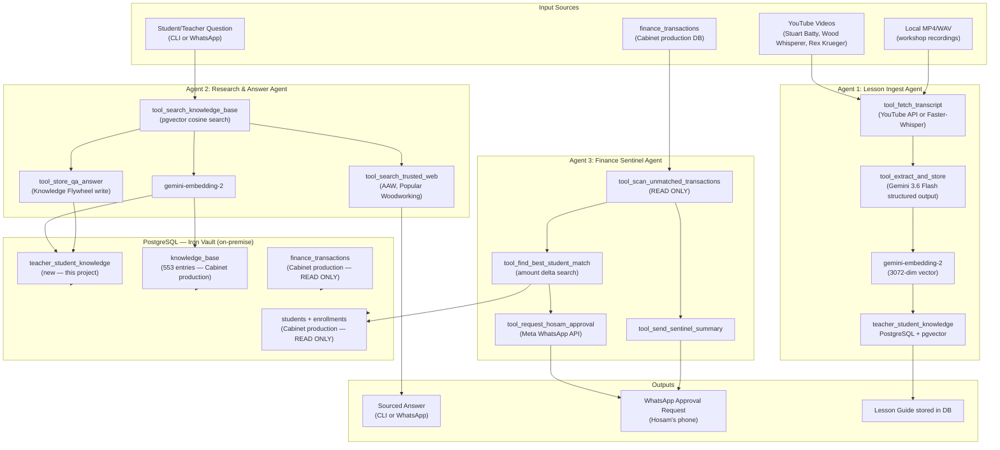

# Architecture — The Cabinet Agentic Suite

## System Overview

The Cabinet Agentic Suite is a three-agent AI system built with Google ADK 2.7.1, running on-premise at The Crafters Hub woodworking school in Cairo, Egypt. It transforms craft video content into structured knowledge, answers student and teacher questions, and monitors financial transactions — all without any human in the loop except for final financial approvals.

---

## Data Flow Diagram



---

## Agent Specifications

### Agent 1: Lesson Ingest Agent

| Property | Value |
|---|---|
| ADK name | `lesson_ingest_agent` |
| Model | `gemini-3.6-flash` |
| Tools | `tool_fetch_transcript`, `tool_extract_and_store` |
| Output | `teacher_student_knowledge` row (content_type=`video_extract`) |

**Extraction schema** (Gemini structured output):
- `technique_name` — main technique demonstrated
- `category` — woodturning / joinery / finishing / hand_tools / etc.
- `materials` — list of materials mentioned
- `tools` — list of tools mentioned
- `safety_notes` — all safety warnings extracted
- `skill_level` — beginner / intermediate / advanced
- `step_by_step` — ordered steps as list
- `key_concepts` — principles the learner must understand
- `common_mistakes` — errors beginners make

### Agent 2: Research & Answer Agent

| Property | Value |
|---|---|
| ADK name | `craft_research_agent` |
| Model | `gemini-3.6-flash` |
| Tools | `tool_search_knowledge_base`, `tool_search_trusted_web`, `tool_store_qa_answer` |
| Output | Sourced answer + `teacher_student_knowledge` row (content_type=`qa_pair`) |

**Search priority** (strictly followed by agent instruction):
1. `teacher_student_knowledge` (pgvector cosine, score > 0.75 = use directly)
2. `knowledge_base` (553-entry Cabinet KB, ILIKE text search)
3. Pre-approved trusted web sources (AAW, Popular Woodworking, Woodcraft)
4. Gemini general knowledge (confidence=`synthesized`, clearly labeled)

### Agent 3: Finance Sentinel Agent

| Property | Value |
|---|---|
| ADK name | `finance_sentinel_agent` |
| Model | `gemini-3.6-flash` |
| Tools | `tool_scan_unmatched_transactions`, `tool_find_best_student_match`, `tool_request_hosam_approval`, `tool_send_sentinel_summary` |
| DB access | READ ONLY on `finance_transactions`, `students`, `enrollments` |
| Write access | NONE — all modifications require Hosam's explicit WhatsApp reply |

**Human-in-the-loop flow:**
```
Sentinel scans → finds unmatched transaction → finds best student match
→ sends WhatsApp: "APPROVE-{id} or REJECT-{id}"
→ Hosam replies manually
→ (future: approval handler updates DB on APPROVE reply)
```

---

## The Knowledge Flywheel

The self-reinforcing learning loop is the core innovation of this system:

```
  New Video
      │
      ▼
  Ingest Agent
  extracts knowledge
      │
      ▼
  teacher_student_knowledge
  (grows with every ingest)
      │              ▲
      ▼              │
  Student asks       │
  a question         │
      │              │
      ▼              │
  Research Agent  ───┘
  searches DB first    saves every
  (if found → fast)    new Q&A pair
  (if not → web →
   Gemini → answer)
```

**Effect:** The first time a question is asked, Gemini synthesizes an answer from web + knowledge. The second time, it retrieves the stored answer in milliseconds — no API call needed. Over months, the system becomes a comprehensive woodturning encyclopedia built from real usage patterns.

---

## Tech Stack

| Component | Technology | Version |
|---|---|---|
| Agent Framework | Google Agent Development Kit (ADK) | 2.7.1 |
| LLM + Extraction | Gemini 3.6 Flash | `gemini-3.6-flash` |
| Embeddings | Gemini Embedding 2 | `gemini-embedding-2` (3072-dim) |
| Database | PostgreSQL | 16 |
| Vector Search | pgvector | 0.7+ |
| DB Client | psycopg2-binary | 2.9.11 |
| YouTube Transcripts | youtube-transcript-api | 1.2.4 |
| Local Transcription | Faster-Whisper | ≥1.0.0 |
| WhatsApp Notifications | Meta WhatsApp Cloud API | v20.0 |
| Terminal UI | Rich | 13.9.4 |
| Runtime | Python | 3.13.7 |
| Environment | Windows 11, on-premise | — |

---

## Security Design

- **No hardcoded credentials** — all secrets loaded from `D:\TheCraftersHub_DataLab\.env` via python-dotenv
- **Finance DB is read-only** — no ADK tool has INSERT/UPDATE/DELETE on Cabinet tables
- **WhatsApp approval required** — Sentinel cannot finalize any match without explicit `APPROVE-{id}` reply from Hosam's registered number
- **Trusted sources only** — web search is restricted to 3 pre-approved domains; no open internet search

---

## Infrastructure

The system runs on The Crafters Hub's on-premise server (referred to as "The Iron Vault"):
- PostgreSQL 16 with pgvector extension
- Docker stack (Cabinet API, Metabase, n8n, Cloudflare tunnel)
- Python 3.13.7 via standard system install
- Gemini API calls go out via Cloudflare → Google API

**GreenOps principle:** No new cloud services were created for this project. All compute runs on existing hardware. The only external API calls are to Google Gemini (paid per token) and Meta WhatsApp Cloud API (free tier).

---

## Alignment with Hackathon Criteria

### All Things Agentic
- ✅ Multi-agent architecture (3 specialized agents)
- ✅ Tool use (8 tools across 3 agents)
- ✅ Real-world agentic loop (Sentinel's human-in-the-loop)
- ✅ Autonomous decision-making (Research Agent decides source priority)
- ✅ Memory / Knowledge accumulation (the flywheel)

### DevNetwork API + Cloud + AI
- ✅ Google Gemini API — generation + embeddings
- ✅ Google ADK — multi-agent orchestration
- ✅ PostgreSQL + pgvector — vector search
- ✅ Meta WhatsApp Cloud API — real-world notification delivery
- ✅ Production deployment — live at The Crafters Hub, serving real students
